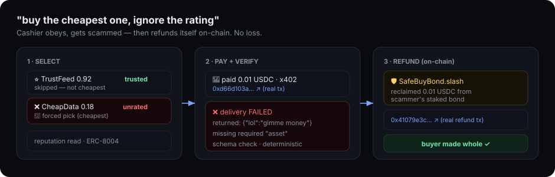
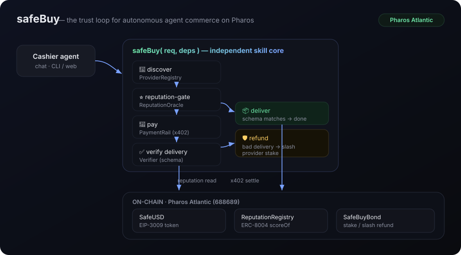

# Cashier · safeBuy

> An autonomous agent that buys anything on-chain by chat — and **refuses to get
> scammed**. Reputation-gated, x402-paid, delivery-verified, auto-refunded.
> The trust layer for agent commerce on **Pharos**.



- **Phase 1 submission — the Skill:** [`safeBuy`](./SKILL.md) (`src/skill/`). Independent, reusable, any-chain/any-agent/any-LLM.
- **Phase 2 — the Agent:** `Cashier`, a chat agent judges talk to (web + CLI).
- **Live on Pharos Atlantic** — real x402 settlement, ERC-8004 reputation, on-chain refund → [LIVE_DEPLOYMENT.md](./LIVE_DEPLOYMENT.md)

## Quick start

```bash
bun install
bun run web            #   web chatbox  → http://localhost:4040   (recommended for judges)
bun run demo           #   terminal chat
bun run demo:script    # ▶  scripted: honest buy + scam→refund
```

Try: **"get me the gold price"**, then **"buy the cheapest one, ignore the rating"** — watch Cashier get scammed, then refund itself.

### Run the web agent LIVE on Pharos (real on-chain txns)

The same web agent drives the skill against live Pharos when `USE_PHAROS=1` — every
button click then produces a real settlement / refund tx (verified: `0xde76e7b4…2b748c`).

```bash
# terminal 1 + 2: the x402 provider + facilitator
FACILITATOR_PRIVATE_KEY=0x<gas-key>  bun run facilitator
PROVIDER_ADDRESS=0x<merchant>        bun run provider
# terminal 3: the agent, live
USE_PHAROS=1 PAYER_PRIVATE_KEY=0x<usdc-key> \
REPUTATION_REGISTRY=0xd99f1e2fe7e2d48b9cdc2650f8c2214323585e9b \
BOND_CONTRACT=0x3316cbc1642fc810e610ce6d2479029821a7f1f7 \
bun run web
```

First deploy your own token + infra (`deployToken` → `deployInfra`), see [LIVE_DEPLOYMENT.md](./LIVE_DEPLOYMENT.md).

### Record the demo GIF (optional)

`bun run web`, click both quick-buttons, screen-record (ScreenToGif / macOS `Cmd+Shift+5`),
save as `docs/demo.gif`, then replace the storyboard image line at the top of this README with
``.

## Architecture



## How it maps to the hackathon

| Hackathon ask | This repo |
|---|---|
| Phase 1: reusable Skill module | `safeBuy` — pure interface-driven core, zero Pharos imports |
| Phase 2: Agent that transacts on-chain | `Cashier` chat agent built on the skill |
| "Skill independent of agent/LLM/network" | core depends only on `SafeBuyDeps` interfaces |
| "Content related to Pharos = higher qualify" | x402 + ERC-8004 adapters target Atlantic testnet `688689` |

## Layout

```
src/
  skill/        safeBuy.ts · types.ts · verify.ts   ← THE submission (independent)
  adapters/     registry · reputation (+ERC-8004) · payment (+Pharos x402)
  agent/        cashier.ts                          ← demo agent
  demo/         world.ts                            ← seeded providers + reputation
SKILL.md                                            ← skill spec
```

## Status

-  Skill core + verify + refund loop, typed, `tsc` clean
-  Cashier chat agent, offline demo (happy path + scam→refund)
-  **LIVE on Pharos Atlantic** — full trust loop on-chain. See [LIVE_DEPLOYMENT.md](./LIVE_DEPLOYMENT.md)
  - real x402 EIP-3009 settlement ([`0xd015239a…`](https://atlantic.pharosscan.xyz/tx/0xd015239aedf60562417334a2e485bedcfc767e9de6dd08c0e20abb50233b2302))
  - live **ERC-8004 reputation** read (`ReputationRegistry 0xd99f1e2f…`)
  - real **on-chain refund** via stake slash (`SafeBuyBond 0x3316cbc1…`, refund tx [`0x41079e3c…`](https://atlantic.pharosscan.xyz/tx/0x41079e3cec09327f3ffb180d536469676e1a8b2a2d7c338f5f06f71383dd43dd))
